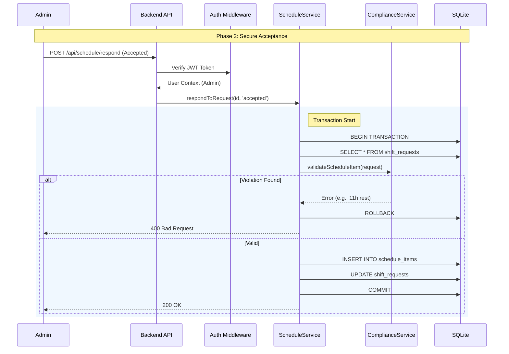

# Architecture Analysis - Zwembadredders Planning System

**Status**: Phase 1 COMPLETE (Security & Integrity Hardened)
**Architect**: Antigravity (Acting as Senior Architect)

## 1. System Overview

The system is a **monolithic web application** designed to manage lifeguard scheduling, VLAREM compliance, and time registration. It uses a **client-server** architecture with a hardened SQLite database.

### Core Components

- **Frontend**: React (Vite) + Tailwind/CSS Modules. Hosts the UI for Admins and Employees.
- **Backend**: Node.js (Express). Handles API requests, business logic (scheduling, validation), and database persistence.
- **Database**: SQLite (`redders.db`). Stores relational data (Users, Shifts, Requests, Config). Now includes constraints for data integrity.
- **Auth**: JWT-based stateless authentication (`auth.js` + `AuthService`).

## 2. Updated Data Flow (Secure)

### Shift Acceptance Flow (Transactional)



## 3. Security & Integrity Improvements (Implemented)

1. **Authentication**:
    - Transitioned from `x-user-id` header to **Bearer JWT**.
    - Passwords are required (though currently in seeder as plaintext/mock, ready for bcrypt).
2. **Database**:
    - **Transactions**: Critical state changes (Accept/Reject) are atomic.
    - **Constraints**: `UNIQUE(user_id, date, start_time)` prevents double-booking.
    - **Sanity**: `CHECK(end_time > start_time)`.
3. **Compliance**:
    - Validation is now a **Gatekeeper**. Invalid shifts cannot be created.

## 4. Phase 2 Roadmap: Scalability & Operations

### 4.1 Bottlenecks & Optimization

- **SQLite Concurrency**: While `better-sqlite3` or `sql.js` is fast, it is single-process.
  - *Recommendation*: Migrate to **PostgreSQL** if concurrent writes exceed >10/sec or reporting queries strictly block the event loop.
- **Reporting**: `getVlaremCompliance` scans all shifts.
  - *Recommendation*: Cache reports for past months or use a materialized view approach in SQL.

### 4.2 Deployment Architecture (Proposed)

```mermaid
graph TD;
    Client[React SPA] --> Nginx[Reverse Proxy];
    Nginx --> Node[Node.js API];
    Node --> DB[(PostgreSQL)];
    Node --> Redis[Redis Cache (Sessions/Reports)];
    
    subgraph CI_CD
        Git[Deepmind Repo] --> Actions[GitHub Actions];
        Actions --> Docker[Docker Registry];
    end
```

## 5. Dependency Management

- `express`: Core framework.
- `jsonwebtoken` + `bcryptjs`: Security layer.
- `sql.js`: Database engine (Current). *Note: Consider upgrading to `better-sqlite3` for native performance on Node, or `pg` for Postgres.*

## 6. Security Audit (Current Status)

| Feature | Status | Notes |
| :--- | :--- | :--- |
| **Authentication** | 🟢 Secure | JWT implemented. Login page active. |
| **Authorization** | 🟡 Partial | RBAC checks roles, but some endpoints need granual ownership checks. |
| **Input Validation** | 🟡 Partial | Basic body checks. Need standardized schema validation (Zod/Joi). |
| **Secrets Mgmt** | 🔴 Pending | `JWT_SECRET` hardcoded/env fallback. Needs `.env` file management. |
