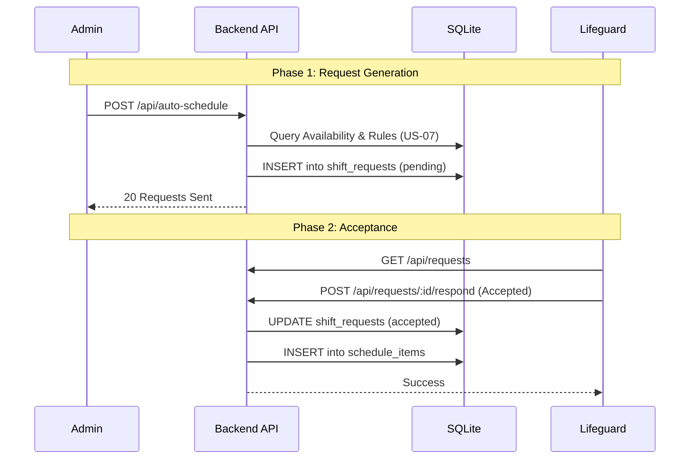
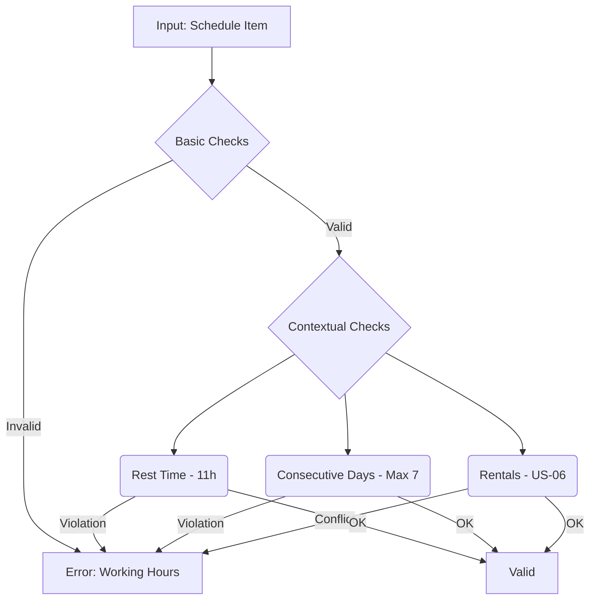

# Architecture Analysis - Zwembadredders Planning System

**Status**: Phase 3 MVP (Implemented)
**Architect**: Antigravity (Acting as Senior Architect)

## 1. System Overview

The system is a monolithic web application designed to manage lifeguard scheduling, VLAREM compliance, and time registration. It uses a **client-server** architecture with a lightweight SQLite database.

### Core Components

- **Frontend**: React (Vite) + Tailwind/CSS Modules. Hosts the UI for Admins and Employees.
- **Backend**: Node.js (Express). Handles API requests, business logic (scheduling, validation), and database persistence.
- **Database**: SQLite (`redders.db`). Stores relational data (Users, Shifts, Requests, Config).

## 2. Data Flow Analysis

### Shift Request Lifecycle

The critical path for operations is the "Shift Request" flow, replacing the traditional direct assignment model.

### Compliance validation Logic

Validation is centrally managed in `validateScheduleItem`.

## 3. Bottlenecks & Risk Analysis

### Current Architecture Limitations (MVP)

1. **Monolithic `server.js`**:
    - **Risk**: The validation logic (`validateScheduleItem`) and business logic are mixed with HTTP routing.
    - **Recommendation**: Extract logic into `services/ScheduleService.js` and `services/ComplianceService.js`.

2. **Synchronous SQLite**:
    - **Risk**: While `better-sqlite3` is fast, heavy analytic queries (like the new `/api/compliance/report`) might block the main event loop if data grows significantly.
    - **Recommendation**: For production with >100 users, migrate to PostgreSQL or run analytics in a worker thread.

3. **Concurrency in Requests**:
    - **Issue**: "Auto-Schedule" creates requests linearly. If two admins run it, it might double-book.
    - **Mitigation**: The current `INSERT OR IGNORE` or status checks are minimal. Database-level constraints are needed.

## 4. Migration Plan (To Production)

### Phase 4: Refactoring (Proposed)

1. **Modularization**: Move `server.js` logic into:
    - `src/routes/`
    - `src/controllers/`
    - `src/services/`
2. **Strict Typing**: As logic grows complex (e.g., 7-day recursive checks), moving to TypeScript (or JSDoc) for the backend is advised.
3. **Testing**:
    - The current logic is tested via UI flow.
    - **Requirement**: Unit tests for `validateScheduleItem` are critical before adding more rules.

## 5. Security Note (RBAC)

- Current RBAC is simplistic (`checkRole` middleware).
- **Gap**: `POST /api/requests/:id/respond` checks `user_id` but relies on client-sent ID in some paths. Ensure strict session-based ID usage (currently using `req.user.id` from header mock which is OK for dev/demo but critical to upgrade for prod).
