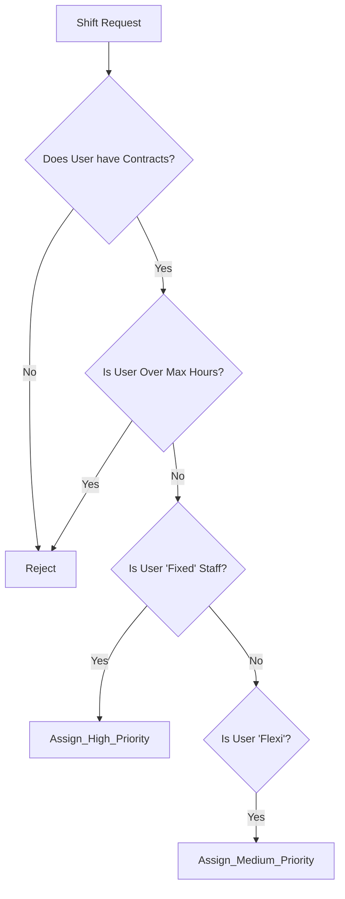

# Business Analyst Review: Requirements & Gap Analysis

**Analyst**: Business Analyst Persona
**Date**: Dec 2025
**Scope**: Functional Review of Zwembadredders v1.0

## 1. Executive Summary

The current system successfully addresses the "Happy Path" of scheduling (Creation, Auto-planning, Basic Compliance). However, significant gaps exist in "Exception Management" (Sickness, Swaps) and "Enterprise Integration" (Payroll, Reporting).

## 2. User Stories & Acceptance Criteria

### Feature: Sickness & Absence Management (MISSING)

*Current state: Admin deletes shift, but no record of sickness is kept.*

**US-10: Report Sickness**
> **As a** Lifeguard
> **I want** to mark myself as "Sick" for a scheduled shift
> **So that** the system can trigger a search for a replacement immediately.

- **Scenario 1: Sickness Reporting**
  - **Given** I have a shift on `2025-01-20` at `09:00`
  - **When** I click "Meld Ziekte"
  - **Then** the shift status changes to `Unfilled`
  - **And** the system creates an `Open Request` for all other eligible lifeguards
  - **And** the Admin receives a notification.

### Feature: Shift Marketplace (Swaps) (MISSING)

*Current state: Manual email/phone coordination.*

**US-11: Shift Swap Request**
> **As a** Lifeguard
> **I want** to post a shift to the "Marketplace"
> **So that** a colleague can pick it up without bothering the planner.

- **Scenario 1: Posting a Swap**
  - **Given** I am owner of shift #123
  - **When** I request a swap
  - **Then** the shift becomes visible in "Open Shifts"
  - **But** I remain responsible until a colleague accepts AND Admin approves.

### Feature: Payroll Export (MISSING)

*Current state: Admin sees hours on screen.*

**US-12: Monthly Payroll Export**
> **As a** Finance Admin
> **I want** to export a CSV/dimona-compatible file of verified hours
> **So that** I don't have to manually type 50+ timesheets into the payroll software.

## 3. Gap Analysis (As-Is vs To-Be)

| Process | As-Is (System v1) | To-Be (Ideal State) | Gap Severity |
| :--- | :--- | :--- | :--- |
| **Shift Creation** | Manual / Random Auto-fill | Logic-based Auto-fill (Fairness algorithm) | 🟡 Medium |
| **Compliance** | Blocks illegal shifts | Proactive warnings during auto-plan | 🟢 Low |
| **Changes** | Delete & Re-create | Swap Workflow / Sickness Workflow | 🔴 High |
| **Communication** | None (User checks site) | Email/SMS Notifications | 🔴 High |
| **Payroll** | Visual Report only | CSV/JSON Export | 🔴 High |

## 4. Edge Cases Identified (Unhappy Paths)

1. **The "Partial Sickness"**: A lifeguard goes home halfway through a shift. Current system only allows full shift blocks.
    - *Solution needed*: Split shift functionality.
2. **The "Double Diploma"**: A user is both a Lifeguard and an Instructor. If they teach from 09:00-12:00, can they guard from 12:00-16:00?
    - *Check*: Does the 11h rest rule apply between roles? (Likely no, but needs verification).
3. **Last Minute Cancellation**: A shift is cancelled < 1 hour before start.
    - *Requirement*: SMS Alert integration (Twilio/MessageBird).

## 5. Decision Tree: Shift Assignment Priority

